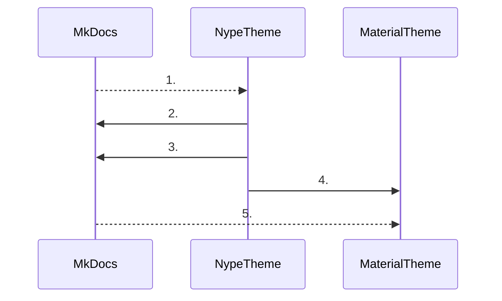

# Reference

Nype's theme for MkDocs runs on top of the Material for MkDocs theme. This allows to inherit all of the
styling and templates of the Material theme, and override them as needed.

This theme was created after multiple hooks were maintained and synced across multiple Nype
projects, basically to simplify this process and have one common place where all of the hooks and
overrides reside.

Because of these origins, some plugins are only adjusted hooks, without a way to configure them,
and they expect a specific setup. Additionally, in case that some MkDocs update invalidates some of
our hacks, there are some safety checks being made during the build process. Therefore, this theme
should only be used as a reference of examples on how to do certain things, or how not to do them:

- Code executed when the theme is imported in [`__init__.py`][Nype Init],
- Injected plugins not added to the `mkdocs.yml`,
- Hijacked and extended Material theme plugins,
- Global [macros][mkdocs-macros-plugin] available in all projects,
- Computing logic inside of templates in the rendering stage,
- Project preprocessing, including minification for deployment in [`__main__.py`][Nype Main].

The theme has a variety of hacks :grin:

!!! warning "Status of the project"

    This project is in Alpha/Beta stage, without tagged versions. It prioritizes the needs of Nype
    projects, and breaking changes could come without notice. So users outside of Nype's scope are
    invited to use parts of this project as reference for hooks or enable plugins using a scoped name
    without enabling the theme `nype/pluginame` or install the project using a commit hash :v:

[Nype Init]: mkdocs_nype/init.md
[Nype Main]: mkdocs_nype/main.md
[mkdocs-macros-plugin]: https://github.com/fralau/mkdocs-macros-plugin

## How it works

This project is a hack on top of other hacks.



1. `mkdocs build` runs, Nype's theme is imported.
2. Plugin loading logic gets overriden to make sure `nype/nype_tweaks` gets loaded even if it's not in `mkdocs.yml`.
3. Plugin loading logic gets overriden to make sure both, `nype/pluginname` and `material/pluginname` namespaces are looked up.
4. Material theme plugin gets directly extended to allow direct PluginConfig assignment on the given plugin. This is a recent
   addition, for the BlogPlugin, as before most of the monkey patching was done during the event loop from other plugins. This
   allows for better UX, however it removes the ease of portability of the implementation.
5. This theme got imported, but it extends the `material` theme, so it also gets imported and the templates paths are merged.

Afterwards, the plugins are imported and the [`event loop`][MkDocs Event Loop] starts. The [`nype_tweaks`][Nype Tweaks] plugin
is always activated, so it's also considered a core part of the theme. Among other things it monkey patches the
[macros][mkdocs-macros-plugin] plugin to include the global theme templates.

For deployment the theme acts also as a preprocessor, minifying JS and CSS assets. In the future assets merging might also be
possible, limiting the amount of requests per connection.

[MkDocs Event Loop]: https://www.mkdocs.org/dev-guide/plugins/#events
[Nype Tweaks]: mkdocs_nype/plugins/nype_tweaks/index.md

## Installation

There is no PyPi package, and there won't be one until the project is considered stable with
semantic tagged `1.0.0` version. So for installation both, `pip` and `git` need to be available.

```shell
pip install git+https://github.com/nypesap/mkdocs-nype.git#egg=mkdocs_nype
```

To install a specific commit, it's possible to by adding `@commit_hash`:

```shell
pip install git+https://github.com/nypesap/mkdocs-nype.git@a1b2c3d4e5f6#egg=mkdocs_nype
```

## Activation

To enable the theme add this to your `mkdocs.yml` file:

```yaml
theme:
  name: nype
```

## Configuration

All of the Material for MkDocs theme settings are inherited. For more information about them go [here][Material Setup].
Different configuration settings specific for this theme are explained [here][Nype Configuration].

[Material Setup]: https://squidfunk.github.io/mkdocs-material/setup/
[Nype Configuration]: mkdocs_nype/templates/index.md
